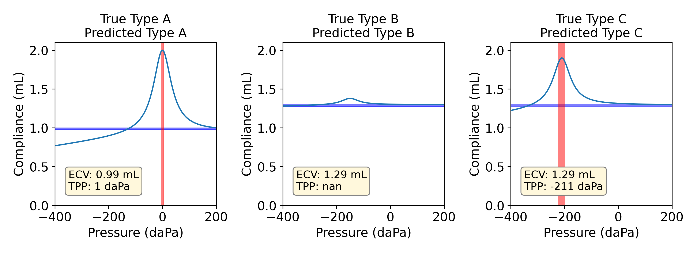

# mHealth Tympanometry ML Classifier
The ML tympanometry tracing classifier from
Jin et al. "A Hybrid Deep Learning Approach to Identify Preventable Childhood Hearing Loss".
(under review)


## Getting Started
The model computes the ECV, TPP, and associated uncertainties. It then classifies tympanometry tracings as type A, B, or C.
This repo contains:
* `example.ipynb`: Jupyter notebook with usage examples
* `utils.py`: code for helper functions
* `model.pt`: trained model

## Citation
```bibtex
@article{jin2022hybrid,
  title={A Hybrid Deep Learning Approach to Identify Preventable Childhood Hearing Loss},
  author={Jin, Felix Q and Huang, Ouwen and Robler, Samantha Kleindienst and Morton, Sarah and Platt, Alyssa and Egger, Joseph and Emmett, Susan D and Palmeri, Mark L}
}
```

## Funding
The study was funded by the Patient-Centered Outcomes Research Institute (PCORI AD-1602-34571) and by the Duke Global Health Institute AI Pilot Research Grant.

## License
Copyright 2022 The Authors

Licensed under the Apache License, Version 2.0 (the "License");
you may not use this file except in compliance with the License.
You may obtain a copy of the License at

   http://www.apache.org/licenses/LICENSE-2.0

Unless required by applicable law or agreed to in writing, software
distributed under the License is distributed on an "AS IS" BASIS,
WITHOUT WARRANTIES OR CONDITIONS OF ANY KIND, either express or implied.
See the License for the specific language governing permissions and
limitations under the License.
